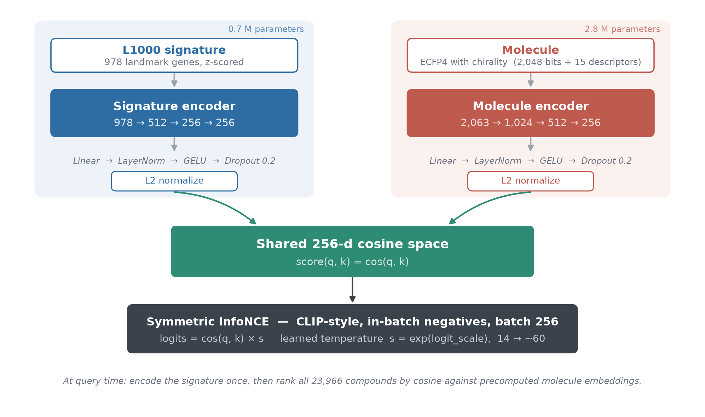
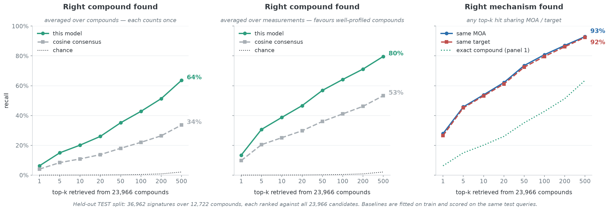

# GeneToMol


**Gene expression in, molecule out.** GeneToMol reads the transcriptomic
signature a cell produces — which genes went up, which went down — and
returns a ranked list of the small molecules most likely to have caused it, out
of a library of 23,966. That signature is 978 *landmark* genes: the subset the
L1000 assay measures directly, chosen because the rest of the transcriptome can
largely be inferred from them.

> [!TIP]
> **Try it.** GeneToMol is hosted as a web app — no install, upload a table
> and read the ranked hits. See [Use the hosted app](#use-the-hosted-app).

[Why this matters](#why-this-matters) · [How it works](#how-it-works) ·
[Status](#status) · [Use the hosted app](#use-the-hosted-app) ·
[Build it yourself](#run-it-step-by-step) ·
[Query your own data](#query-it-with-your-own-expression-data)

## Why this matters

A cell responding to a drug leaves a readable trace. Thousands of genes shift
together, and that pattern is close to a fingerprint of what the compound did to
the cell — which pathway it hit, which mechanism it engaged. Reading the
fingerprint backwards is one of the oldest questions in chemical biology, and it
shows up in three places that matter:

- **Deconvolution.** A phenotypic screen found a hit and nobody knows what it
  is. Match its signature against a library that has already been profiled.
- **Mechanism of action (MOA).** A compound works and nobody knows why. The
  compounds it retrieves share a mechanism far more often than chance, so the
  ranked list is a hypothesis about the target.
- **Drug repurposing.** Take the signature of a disease state, invert it, and
  ask which existing compounds push the cell the other way.

The classical answer is the Connectivity Map (CMap): correlate the query against
each compound's average profile and sort. It works, and it has a hard ceiling —
correlation only compares a signature with signatures, so a compound that was
never profiled cannot be scored at all.

GeneToMol is trained on **LINCS L1000** (Library of Integrated Network-Based
Cellular Signatures), a public screen of ~34,000 compounds profiled across human
cell lines. 23,966 compounds with transcriptional activity scores > 0.1 were used for 
the model training. GeneToMol replaces CMap's correlation with a **learned shared space**. Two
neural encoders are trained together, one reading gene expression and one reading
chemical structure, until a compound's structure and the signature it produces
land in the same place. Retrieval is then a cosine similarity in that space.
Because the molecule side is a *function of structure* rather than a lookup of
past measurements, the model can score chemistry it has never seen.

On held-out test data it puts the exact compound in the top 10 for **20.1%**
of queries and a same-mechanism compound in the top 10 for **53.9%** — **1.91x**
the Connectivity Map baseline.

One honest caveat before anything else: this is a shortlisting tool, not an
oracle. Cosine is a similarity, not a probability, and the value of the output
is a ranked list to test, not an answer to trust.

## How it works

Two independent multilayer perceptron (MLP) trunks write into one shared
256-dimensional cosine space, trained with symmetric InfoNCE (Information
Noise-Contrastive Estimation, a contrastive loss). This is the recipe behind
CLIP, the image—text model, with gene expression in place of images and
chemical structure in place of captions. Each signature's own
compound is the positive and the rest of the batch are negatives, so the two
towers are pulled into agreement. Nothing is shared between them except the
embedding dimension and the temperature.



- **`SignatureEncoder` sees the expression vector and nothing else.** No cell
  line, no dose, no timepoint. A real query carries none of those either, so the
  model is never handed anything during testing that it would lack in practice.
  That is why the figures in this README are what you should actually expect,
  rather than a best case measured under conditions you could not reproduce.
- **`MoleculeEncoder` is a function of structure alone.** That is what lets the
  model score a compound with no signature of its own.
- **Temperature is learned**, initialized at 0.07 and clamped so `logit_scale`
  stays in `[1, 100]`.

## Status

Working, trained, and running as a hosted web app.

**The task is library matching**: a new measurement arrives and the compound
behind it is already somewhere in the library.



The three panels answer three different questions, and they are not
interchangeable. **Left** is recall per compound: every compound counts once,
however often it was profiled. **Middle** is recall per signature. **Right** 
asks only that some top-k hit shares the query's mechanism, which is the number 
to plan around if a same-MOA answer is useful to you.

[Step 6](#6-train) below reproduces the model training result into `runs/genetomol`. 
The baseline it beats by 1.91x is cosine consensus against each compound's mean 
training signature, which is the CMap method.

**Two things to know:**

1. **Mechanism is easier than identity.** A same-MOA compound reaches the top
   10 about 54% of the time where the exact compound reaches it 20%. If a
   same-mechanism answer is useful, plan around that number.
2. **These are upper bounds.** LINCS signatures are not independent — of transcriptomic 
   signatures used for the model, 63% share a detection plate with another signature 
   of the same compound, 89% a bead batch.

## Use the hosted app

GeneToMol runs as a hosted web app, so nothing has to be installed to use it.

> [!IMPORTANT]
> **Address: https://genetomol.streamlit.app/**

Upload a pair of tables — treated samples and their controls — and it ranks
all 23,966 compounds. It applies the same coverage and reliability guards
described under [Query it with your own expression data](#query-it-with-your-own-expression-data).

## Run it: step by step

Everything above needs no installation. This section is the other path:
rebuilding GeneToMol from the LINCS source — download, prepare, train — which
is what you want in order to retrain on your own data, change the architecture,
or reproduce the numbers in Status.

Paths below assume `../lincs` for data. Every step is resumable or re-runnable.

### 1. Install

Python 3.10 or newer, in a conda environment. The only thing that differs
between machines is the torch wheel, so pick one of the three blocks below;
everything after it is identical.

```bash
conda create -n genetomol --override-channels -c conda-forge python=3.12 pip -y
conda activate genetomol
python -m pip install -U pip
```

**a. CPU only — any OS.**

```bash
pip install torch --index-url https://download.pytorch.org/whl/cpu
```

**b. NVIDIA GPU — Linux or Windows.** `cu126` below is an example — read the
CUDA version your driver supports off `nvidia-smi`, then take the matching index
URL from [pytorch.org/get-started/locally](https://pytorch.org/get-started/locally/).

```bash
pip install torch --index-url https://download.pytorch.org/whl/cu126
```

**c. Mac — Apple Silicon or Intel.** The default wheel is correct; there is no
CUDA on macOS. On Apple Silicon it carries the Metal Performance Shaders (MPS)
backend, so the GPU is
reachable as `--device mps`.

```bash
pip install torch
```

Then, on every platform:

```bash
pip install numpy pandas rdkit
pip install cmapPy                     
pip install matplotlib tqdm             
git clone https://github.com/zhangluhui/GeneToMol.git
cd GeneToMol                            
pip install -e . --no-deps              # optional
python -m genetomol.smoke_test          # ~1 min, must pass before anything else
```

### 2. Metadata (~470 MB, minutes)

```bash
python -m genetomol.download --dest ../lincs --what metadata
```

### 3. Census — decide before you download 33 GB

```bash
python -m genetomol.census \
  --siginfo ../lincs/siginfo_beta.txt \
  --compoundinfo ../lincs/compoundinfo_beta.txt \
  --out ../lincs/census.json
```

### 4. The matrix (33 GB, hours — resumable)

```bash
python -m genetomol.download --dest ../lincs --what matrix
python -m genetomol.download --dest ../lincs --what all --verify
```

### 5. Prepare (~30-60 min)

```bash
python -m genetomol.prepare \
  --gctx ../lincs/level5_beta_trt_cp_n720216x12328.gctx\
  --siginfo ../lincs/siginfo_beta.txt \
  --geneinfo ../lincs/geneinfo_beta.txt \
  --compoundinfo ../lincs/compoundinfo_beta.txt \
  --out ../lincs/prepared
```

Add `--dry-run` first to re-check the counts without touching the GCTX matrix. Lower
`--chunk-size` (default 20000) if memory is tight.

### 6. Train

This is the configuration behind the released checkpoint and every number in
this README — ECFP4 with chirality, dropout 0.2, signature trunk (512, 256),
60 epochs on the signature split:

```bash
python -m genetomol.train --data ../lincs/prepared \
  --mol-features ../lincs/prepared/ecfp_chiral.npz \
  --split signature --epochs 60 --dropout 0.2 --sig-hidden 512,256 \
  --out runs/genetomol
```

Then plot the result (needs `pip install -e .[plot]`):

```bash
python -m genetomol.plot runs/genetomol
```

Two PNGs land in the run directory:

- `training.png` — four panels: **loss (train and validation)**, the learning rate and
  temperature schedules, **exact-compound retrieval (train and validation)**,
  and MOA/target hit rate. Validation exists only on evaluation epochs
  (`--eval-every`, default 5), so those curves are marked points on a sparse x,
  not a line through every epoch. The retrieval panel draws k = 1, 10, 50 only.
- `baselines.png` — final held-out test recall for the model against every
  baseline, plus the model's MOA and target hit rate.

## Query it with your own expression data

The model ranks all 23,966 compounds in the library for a signature you supply.

### Start from treated and control samples

```bash
python -m genetomol.retrieve --data ../lincs/prepared \
  --run runs/genetomol \
  --mol-features ../lincs/prepared/ecfp_chiral.npz \
  --query treated.csv --control control.csv --log \
  --geneinfo ../lincs/geneinfo_beta.txt --k 25 --out hits.csv
```

**Treated** is the state you are asking about: cells after exposure to the
compound you want to identify. **Control** is the reference it is compared
against -- untreated or vehicle-treated cells. The model reads the difference
between the two.

Both files take the same shape: a header row, the gene identifier in the first
column, one sample per remaining column.

```csv
gene_symbol,rep1,rep2,rep3
AARS1,12.3,11.8,12.1
ABCB6,4.1,4.6,4.4
```

Identifiers may be **Entrez ids**, **gene symbols**, or
**Ensembl ids**; the latter two need `--geneinfo geneinfo_beta.txt`. Row order is
irrelevant — values are reindexed onto the 978 landmarks.

These are **normalized expression values**. `--log` applies `log2(x+1)` first;
drop it if your values are already log-scale. The tool then averages replicates
in log space and subtracts, giving a change per gene.

That change is then put on a **robust z scale**: the median change is subtracted, 
and every gene is divided by one measure of how much the whole contrast varies — 
the median absolute deviation across all genes, so the final numbers say "how large 
is this change compared with the others". *Robust* means the median and the median 
absolute deviation are used in place of the mean and standard deviation, so a handful 
of extreme genes cannot set the scale for everything else.

### Read the reliability line before the hits

How much of your signature is reproducible signal rather than noise? With two or
more replicates on each side, the run answers that with a **split-half**
estimate: it splits your replicates into two halves, computes an independent
contrast from each, and correlates the two. Agreement means signal; disagreement
means you are looking at noise. The halves are kept **disjoint**, and every possible 
pairing is averaged when there are ten or fewer replicates per group; above that, a 
uniform random sample of 5,000 pairings is used instead.

```text
replicate reliability: single contrast rho = +0.31 (mean over 2 disjoint pairings)
averaged over 2 replicates, Spearman-Brown estimate = +0.47
```

Read the **Spearman-Brown** number rather than the single-contrast one. Each
half uses only part of your data, so the split-half correlation describes a
smaller experiment than the one you actually ran; the Spearman-Brown formula
projects it up to the full set of replicates you averaged, which is the
signature retrieval really sees. Compare it with the LINCS ceilings — a
consensus signature scores 0.449 and the shallowest bin measured 0.168:

| your rho | verdict |
|:---:|:---|
| >= 0.40 | comparable to a LINCS consensus (0.449); expect the model works well |
| 0.15 - 0.40 | thin but usable; expect the compound recall worse than 20.1% @ top 10 |
| < 0.15 | below the shallowest LINCS bin (0.168); mostly technical noise |

**More replicates beat any modeling change.** Averaging k replicates takes
reliability `r` to `k*r / (1 + (k-1)*r)`, so two replicates turn 0.30 into 0.46.
